<div align="center">

# 👋 Hi, I'm [BluHExH]

<p align="center">
  
</p>

<!-- Animated HEX Banner -->
<p align="center">
  
</p>


</div>

<!-- Gradient HEX Name -->
<h1 align="center">
  
</h1>


</div>

---


## 🌟 Open Source Contributions

```mermaid
graph LR
    A[🔍 Find Issues] --> B[🍴 Fork Repository]
    B --> C[💻 Write Code]
    C --> D[✅ Test Changes]
    D --> E[📝 Create PR]
    E --> F[🎉 Merged!]
    F --> G[🚀 Impact]
```

<div align="center">



</div>

## 🖤 About Me

```typescript
const developer = {
    name: "Hacker Hex",
    role: "Open Source Developer & Contributor",
    location: "Bangladesh 🌍",
    interests: ["Open Source", "Building Tools", "Community"],
    currentFocus: "Creating impactful open source projects",
    funFact: "I debug with console.log() and I'm not ashamed! 😄"
};
```
<div align="center">
  


</div>


### 💡 What I Do

- 🔭 Currently working on **innovative open source projects**
- 🌱 Learning and exploring **new technologies**
- 👯 Looking to collaborate on **meaningful open source contributions**
- 💬 Ask me about **anything tech-related**
- 📫 How to reach me: **cyber17official.bd@gmail.com**
- ⚡ Fun fact: **Coffee+ smoke + Code = Magic ☕💻**

<br clear="right"/>


## 💼 Experience & Open Source Journey


### 🏅 Achievements
- ✨ Maintainer of popular open source projects
- 🎖️ GitHub Arctic Code Vault Contributor
- 🏆 Hackathon winner (2024)
- 📚 Technical writer & blogger
- 🎤 Speaker at tech meetups

### 🤝 Community Involvement
- 💬 Active in developer communities
- 🎓 Mentoring junior developers
- 📖 Creating educational content
- 🌐 Supporting open source initiatives

<br clear="right"/>

### 🛠️ Tech Stack & Skills

<div align="center">

### Languages


### Frontend


### Backend & Database


### DevOps & Tools


</div>


---


## 💻 Stats & Activity
[](https://git.io/streak-stats)

## 🌐 Connect With Me
<p align="center">
  <a href="https://github.com/BluHExH"></a>
  <a href="mailto:hackerhex@proton.me"></a>
  <a href="https://t.me/Hackerhex9"></a>
</p>


<p align="center">
  <b>“Stay curious. Break systems. Build better ones.”</b>
</p>


<div align="center">

I'm always open to interesting conversations and collaboration opportunities!


**"Code is like humor. When you have to explain it, it's bad." – Cory House**


<div align="center">
  
</div>
